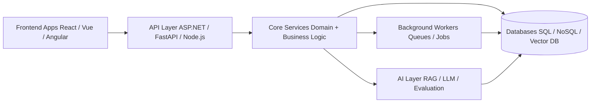
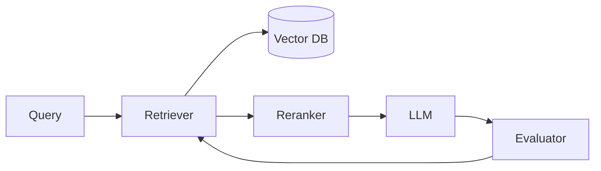

# 🚀 Full-Stack & AI Engineering Portfolio

This portfolio showcases **enterprise-grade backend systems, AI-driven platforms, and full-stack architectures** designed with production-level scalability, observability, and modularity.

It focuses on real-world system design across:

* Distributed backend architectures
* Multi-tenant SaaS systems
* AI / LLM engineering (RAG + evaluation loops)
* Event-driven systems
* Cloud-native deployment (Docker + Kubernetes)
* Full-stack production applications

---

# 🧠 System Architecture Overview

---

# 📌 Featured Projects

---

# 🏗️ 1. .NET Workflow Orchestration Platform

A cloud-native multi-tenant SaaS workflow orchestration platform built with ASP.NET Core.

### Key Capabilities

* Multi-tenant resolution (JWT / header / subdomain)
* JWT + Azure AD authentication
* Policy-based authorization engine
* Dynamic workflow execution engine
* Background hosted workers for async processing
* Docker + Helm deployment

### Architecture

* Platform.Api → API layer
* Platform.Core → domain logic + workflow engine
* Platform.Modules.* → Users, Workflows, Audit

---

# 🤖 2. Python FastAPI Self-Healing RAG Runtime

A production-grade self-improving RAG system with evaluation-driven feedback loops.

### Core Systems

* Hybrid retrieval + reranking pipeline
* Self-healing evaluation engine
* Hallucination detection
* Query rewriting + embedding regeneration
* Full observability tracing

### Flow

---

# 🛒 3. React + Node.js Catalog Management System

Enterprise-grade product catalog system for pricing and inventory workflows.

### Features

* Product catalog APIs
* Pricing override engine
* Inventory workflows
* Redis caching layer
* BullMQ background jobs
* Dockerized full-stack setup

---

# 🛍️ 4. ShopFlow — AI-Powered E-Commerce Platform

A full-stack, microservices-based e-commerce platform with real-time inventory tracking and AI-driven recommendations, designed to reflect production SaaS architecture.

### Key Capabilities

* Product catalog with search, filtering, and SKU management
* JWT-based authentication and secure API access
* Redis-backed cart and checkout system
* Order processing with inventory synchronization
* AI-powered product recommendations (collaborative filtering)
* PostgreSQL schema with constraints, indexing, and optimization

### Tech Stack

* Frontend: React (TypeScript), React Query, Tailwind
* Backend: FastAPI (Python microservices)
* Database: PostgreSQL
* Cache: Redis
* AI Layer: Python (scikit-learn)

### Architecture Highlights

* Microservices-based service separation (product, auth, cart, recommendation)
* Event-ready design for inventory and order workflows
* High-performance API layer with FastAPI
* Redis used for low-latency cart/session management
* Designed for Docker and cloud deployment

---

# 🔐 5. Vue.js + Node.js Auth System (ExperimentFlow)

Secure authentication system with JWT + OAuth.

### Security

* HttpOnly JWT cookies
* OAuth (Google + GitHub)
* bcrypt password hashing
* Protected routes

---

# 📊 6. AngularJS + ASP.NET Incident Intelligence System

Real-time incident detection and business impact analysis platform.

### Capabilities

* Event streaming ingestion
* Root cause analysis engine
* Business impact mapping
* Auto remediation suggestions
* Incident forensics & replay

---

# 🧠 Engineering Highlights

* ASP.NET Core / FastAPI / Node.js / NestJS
* Distributed and event-driven architectures
* RAG + LLM systems with evaluation loops
* Redis + PostgreSQL performance optimization
* Docker + Kubernetes deployment readiness
* Full-stack systems with React / Vue / Angular

---
